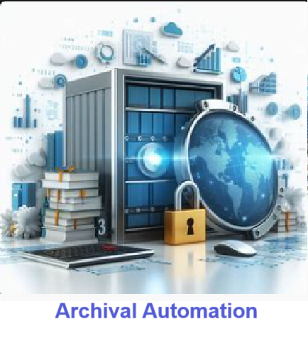
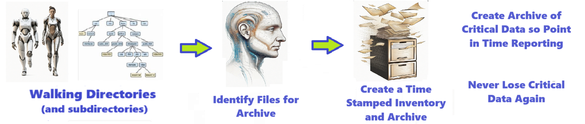

# Archival Automation - Solution for Archival Automation
Solution for Archival Automation

Welcome to the solution **Archival Automation** - an example for your projects

Solution for Archival Automation
## instructions # Archival Automation  - Backup and archive important data sets automatically 

## Description

Welcome to the ** Archival Automation ** repository! This solutions how to archive !!!   

## NOTE - THIS REPOSITORY WORK IN PROGRESS 

The are many ways to do this. It isnt perfect !!! so Experiment. Branch it, configure it, and Change it. 

## Features

- Easily to understand and use  
- Easily Configurable 
- Protects you important Data
- Its Fast and Automated
- It can be scheduled so you never forget 

## Notebook Features

- Self Documenting 
- Self Testing 
- Easily Configurable
- Includes Talking Code - The code explains itself
- Self Logging 
- Self Debugging 
- Low Code - or - No Code
- Educational 

## Getting Started

To get started with the ** Correlation Heatmap ** project, follow these steps:

1. Clone the repository to your local machine.
2. Install the required dependencies listed at the top of the notebook.
3. Explore the example code provided in the repository and experiment.
4. Run the notebook and your find your most Critical Data - EASY !

 

 

## Features
- Easy to understand and use  
- Easily Configurable 
- Quickly start your project with pre-built templates
- Its Fast and Automated

## Notebook Features
- **Self Documenting** - Automatically identifes major steps in notebook 
- **Self Testing** - Unit Testing for each ptyhon function
- **Easily Configurable** -easily modifyable with config.INI name value pairs
- **Includes Talking Code** - The code explains itself.
- **Self Logging** - enhanced python standard logging   
- **Self Debugging** - enhanced python standard debugging
- **Low Code - or - No Code** - Most solutions are under 50 lines of code
- **Educational** - Includes educational dialogue and background material
    
## Getting Started
To get started with the **Archival Automation** solution repository, follow these steps:
1. Clone the repository to your local machine.
2. Install the required dependencies listed at the top of the notebook.
3. Explore the example code provided in the repository and experiment.
4. Run the notebook and make it your own - **EASY !**
    
## https://github.com/JoeEberle/ -- josepheberle@outlook.com 
    

       